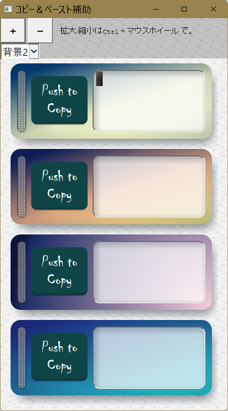

# コピペ補助

### Project repository (public)

https://dev.azure.com/takoyaki0084/%E3%82%B3%E3%83%94%E3%83%9A%E8%A3%9C%E5%8A%A9

「コピペ補助.hta」以外は設定ファイル。
環境は、主に Visual Studio 2019を使用。

### 設定情報
* [Visual Studio Code](doc/VSCode.md)